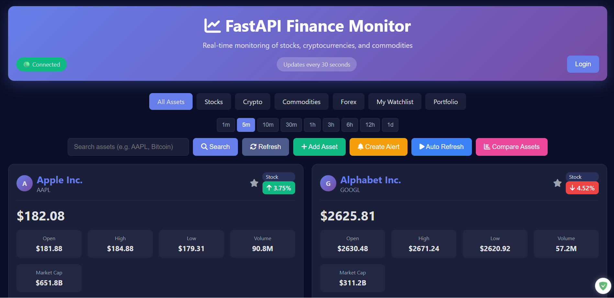
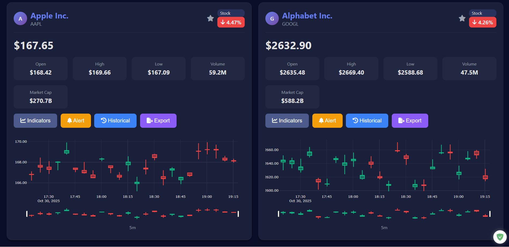

# 📊 FastAPI Finance Monitor





Информационная панель для мониторинга финансовых активов в реальном времени

## ✨ Возможности

- 📈 **Графики в реальном времени** - обновление каждые 30 секунд через WebSocket
- 💹 **Множество типов активов** - акции (Apple, Google, Microsoft, Tesla, Disney, Visa и др.), криптовалюты (Bitcoin, Ethereum, Solana, Cardano и др.), товары (Золото, Нефть, Серебро и др.), валютные пары (EUR/USD, GBP/USD и др.)
- 📊 **Интерактивные графики** - свечные графики для акций, линейные графики для криптовалют (Plotly.js)
- 🎨 **Современный интерфейс** - темная тема, адаптивный дизайн с плавной анимацией
- ⚡ **Асинхронная архитектура** - FastAPI + async/await для высокой производительности
- 🔌 **WebSocket** - мгновенные обновления без перезагрузки страницы
- 🌟 **Списки наблюдения** - персонализированный трекинг активов
- 📈 **Технические индикаторы** - RSI, MACD, Bollinger Bands и другие
- 🔍 **Поиск активов** - поиск и добавление новых активов для отслеживания
- ⏱️ **Множественные интервалы времени** - 1m, 5m, 10m, 30m, 1h, 3h, 6h, 12h, 1d
- 📉 **Управление обновлениями** - автоматическое и ручное обновление данных
- 📁 **Категории активов** - отдельные вкладки для акций, криптовалют, товаров, форекс

## 🏗️ Архитектура

```
fastapi-finance-monitor/
├── app/
│   ├── main.py              # Основное приложение FastAPI
│   ├── models.py            # Модели данных Pydantic
│   ├── config.py            # Конфигурационные настройки
│   ├── database.py          # Подключение к базе данных
│   ├── api/
│   │   ├── routes.py        # REST API эндпоинты
│   │   └── websocket.py     # WebSocket для данных в реальном времени
│   ├── services/
│   │   ├── data_fetcher.py  # Получение данных с бирж
│   │   ├── indicators.py    # Технические индикаторы
│   │   ├── watchlist.py     # Управление списками наблюдения
│   │   ├── portfolio_service.py # Управление портфелем
│   │   ├── alert_service.py # Система уведомлений
│   │   └── auth_service.py  # Аутентификация пользователей
│   ├── tests/
│   │   └── test_services.py # Модульные тесты
├── requirements.txt         # Зависимости Python
├── Dockerfile               # Docker конфигурация
├── docker-compose.yml       # Docker Compose конфигурация
├── .dockerignore            # Файлы для игнорирования в Docker
└── README.md               # Документация
```

## 🚀 Быстрый старт

### Установка

```
# Клонирование репозитория
git clone https://github.com/yourusername/fastapi-finance-monitor.git
cd fastapi-finance-monitor

# Создание виртуального окружения
python -m venv venv
source venv/bin/activate  # Linux/Mac
# или
venv\Scripts\activate  # Windows

# Установка зависимостей
pip install -r requirements.txt
```

### Запуск приложения

```
# Прямой запуск:
python app/main.py

# Или с помощью uvicorn:
uvicorn app.main:app --reload --host 0.0.0.0 --port 8000

# Или с помощью Docker:
docker-compose up -d
```

Откройте браузер: **http://localhost:8000**

## 🔧 Используемые технологии

### Бэкенд

- **FastAPI** - Современный асинхронный веб-фреймворк
- **WebSocket** - Коммуникация в реальном времени
- **yfinance** - Данные Yahoo Finance (акции, товары)
- **CoinGecko API** - Данные криптовалют
- **Pandas** - Обработка данных
- **NumPy** - Числовые вычисления
- **SQLAlchemy** - ORM для работы с базой данных
- **PostgreSQL** - Реляционная база данных
- **JWT** - Токен аутентификация
- **Bcrypt** - Хеширование паролей

### Фронтенд

- **Plotly.js** - Интерактивные графики
- **Vanilla JavaScript** - Клиент WebSocket
- **CSS3** - Современный адаптивный дизайн
- **Font Awesome** - Иконки

## 📊 Поддерживаемые активы

### Акции

- **Американские компании**: Apple, Google, Microsoft, Tesla, Amazon, Meta, NVIDIA, Netflix, Disney, Visa, JPMorgan Chase, Walmart, Procter & Gamble, Coca-Cola, Exxon Mobil, Boeing, IBM, Goldman Sachs, Home Depot, Mastercard и другие
- **Европейские компании**: Nestle, Roche, Novartis, SAP, Siemens, BMW, Daimler, Airbus, Sanofi, BNP Paribas, Enel, Eni, UniCredit, ING, ASML, Unilever, Royal Dutch Shell, BP, HSBC, Barclays, Vodafone, AstraZeneca, GlaxoSmithKline и другие
- **Российские компании**: Gazprom, Lukoil, Sberbank, Rosneft, Norilsk Nickel, Novatek, Alrosa, Tatneft, Surgutneftegas, Severstal, NLMK, Magnit, MTS, FEES, RusHydro и другие
- **Китайские компании**: Alibaba, Tencent, Baidu, JD.com, NetEase, China Mobile, China Unicom, PetroChina, Sinopec, Bank of China, Industrial and Commercial Bank of China, China Construction Bank, Ping An Insurance, Kweichow Moutai, BYD, Xiaomi, Meituan и другие

### Криптовалюты

Bitcoin, Ethereum, Solana, Cardano, Polkadot, Litecoin, Chainlink, Bitcoin Cash, Stellar, Uniswap, Dogecoin, Avalanche, Polygon, Cosmos, Monero, TRON, VeChain, Filecoin, Theta, EOS, Tezos, Elrond, Flow, Klaytn, NEAR, Hedera, Algorand, IOTA, Dash, Zcash и другие

### Товары

- **Драгоценные металлы**: Золото, Серебро, Платина, Палладий (фьючерсы и спот)
- **Энергетика**: Нефть, Природный газ
- **Сельхозпродукты**: Хлопок, Кофе, Сахар, Какао, Живой скот, Свинина, Пшеница, Кукуруза, Овес, Рис, Кормовой скот

### Валютные пары

EUR/USD, GBP/USD, USD/JPY, AUD/USD, USD/CAD, USD/CHF, NZD/USD, EUR/GBP, EUR/JPY, GBP/JPY, AUD/JPY, NZD/JPY, GBP/NZD, EUR/AUD, EUR/CHF, CAD/JPY, CHF/JPY, USD/MXN, USD/ZAR, USD/RUB, EUR/RUB, GBP/RUB и другие

## 🎯 API Эндпоинты

### REST API

- `GET /` - Главная страница информационной панели
- `GET /api/assets` - Получить данные для всех активов в списке наблюдения
- `GET /api/asset/{symbol}` - Получить данные для конкретного актива
- `GET /api/asset/{symbol}/indicators` - Получить технические индикаторы для актива
- `GET /api/search` - Поиск активов
- `POST /api/watchlist/add` - Добавить актив в список наблюдения
- `POST /api/watchlist/remove` - Удалить актив из списка наблюдения
- `GET /api/watchlist` - Получить список наблюдения пользователя
- `GET /api/health` - Проверка состояния
- `POST /api/users/register` - Регистрация пользователя
- `POST /api/users/login` - Вход пользователя
- `POST /api/users/verify-email` - Подтверждение email пользователя
- `POST /api/users/resend-verification` - Повторная отправка подтверждения email
- `GET /api/users/me` - Получить профиль текущего пользователя
- `PUT /api/users/me` - Обновить профиль текущего пользователя
- `PUT /api/users/me/password` - Изменить пароль текущего пользователя
- `GET /api/portfolio` - Получить все портфели пользователя
- `POST /api/portfolio/create` - Создать новый портфель
- `GET /api/portfolio/{id}` - Получить конкретный портфель
- `POST /api/portfolio/add_item` - Добавить актив в портфель
- `POST /api/portfolio/remove_item` - Удалить актив из портфеля
- `GET /api/portfolio/{id}/performance` - Получить метрики производительности портфеля
- `GET /api/portfolio/{id}/holdings` - Получить детальную информацию о позициях в портфеле
- `GET /api/alerts` - Получить уведомления пользователя
- `POST /api/alerts/create` - Создать новое уведомление

### WebSocket

- `WS /ws` - Обновления данных в реальном времени

**Пример подключения:**

```bash
const ws = new WebSocket('ws://localhost:8000/ws');
ws.onmessage = (event) => {
    const data = JSON.parse(event.data);
    console.log(data);
};
```

## 🔨 Кастомизация

### Добавление новых активов

Добавьте новые активы в список в [websocket.py](app/api/websocket.py):

```bash
FINANCIAL_INSTRUMENTS = {
    # Существующие активы...
    'NEW_SYMBOL': {'name': 'New Asset Name', 'type': 'stock/crypto/commodity/forex'},
}
```

### Изменение интервала обновления

Измените интервал обновления в [websocket.py](app/api/websocket.py):

```bash
await asyncio.sleep(30)  # 30 секунд -> любое значение
```

### Добавление технических индикаторов

Сервис [indicators.py](app/services/indicators.py) включает RSI, MACD, Bollinger Bands и другие. Вы можете добавить дополнительные индикаторы при необходимости.

## 📈 Примеры использования

### Получение данных через API

```bash
curl http://localhost:8000/api/assets
```

### Подключение к WebSocket (Python)

```bash
import asyncio
import websockets
import json

async def listen():
    async with websockets.connect('ws://localhost:8000/ws') as ws:
        while True:
            message = await ws.recv()
            data = json.loads(message)
            print(data)

asyncio.run(listen())
```

## ⚠️ Важные замечания

1. **Ограничения по запросам** - Yahoo Finance и CoinGecko имеют ограничения. Не уменьшайте интервал обновления менее чем до 10 секунд
2. **API ключи** - Текущая версия использует бесплатные API без ключей. Для продакшена используйте платные API с ключами
3. **Данные в реальном времени** - Yahoo Finance предоставляет данные с задержкой ~15 минут для некоторых бирж
4. **Производительность** - При большом количестве активов рекомендуется использовать кэширование

## 🚀 Планы развития

- [x] Модульная архитектура проекта
- [x] Технические индикаторы (RSI, MACD, Bollinger Bands, и др.)
- [x] Списки наблюдения и избранное
- [x] Улучшенный интерфейс с темной темой и анимациями
- [x] Множественные интервалы времени
- [x] Расширенный список финансовых инструментов
- [x] Система портфолио и уведомлений
- [x] Аутентификация пользователей
- [x] Полная реализация системы портфолио с API эндпоинтами
- [ ] Кэширование Redis для улучшения производительности
- [ ] Уведомления по электронной почте/Telegram о ценах
- [ ] Исторические данные (просмотр за 1 месяц, 1 год)
- [ ] Сравнение нескольких активов на одном графике
- [ ] Экспорт данных (CSV, Excel)
- [ ] Мобильное приложение

## 📝 Лицензия

[Этот проект лицензирован под лицензией MIT](LICENCE)

Для получения дополнительной информации ознакомьтесь с файлом `LICENSE`

## 🤝 Участие в разработке

Pull requests приветствуются! Для крупных изменений сначала создайте issue.

## 📧 Контакты

Вопросы и предложения: [создайте issue](https://github.com/yourusername/fastapi-finance-monitor/issues)

---

**Сделано с ❤️ используя FastAPI**

---

💼 **Автор:** Дуплей Максим Игоревич

📲 **Telegram №1:** [@quadd4rv1n7](https://t.me/quadd4rv1n7)

📲 **Telegram №2:** [@dupley_maxim_1999](https://t.me/dupley_maxim_1999)

📅 **Дата:** 29.10.2025

▶️ **Версия 1.0**

```textline
※ Предложения по сотрудничеству можете присылать на почту ※
📧 maksimqwe42@mail.ru
```
